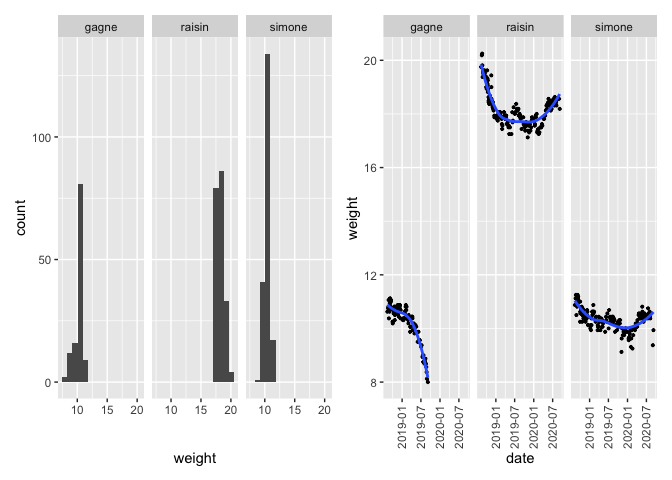

p8105\_mtp\_cl4043
================

``` r
library(tidyverse)
library(readxl)
library(janitor)
library(dplyr)
library(patchwork)
```

``` r
# importing data
dogweight_df = 
  read_excel("./data/dogweights_07sept2020.xlsx", skip = 1)
```

# Problem 1

``` r
# tidy and cleaning
dogweight_df <- dogweight_df  %>%
  janitor::clean_names()

# convert date into date format
dogweight_df <- dogweight_df %>% 
    mutate(date = as.numeric(date),
           date = convert_to_date(date)
         )

# data entry on 2018/10/22  "1810" should be "18 10"
# and on 2019/7/23  "1803" should be "18 03"
dogweight_df$raisin[which(dogweight_df$date == "2018-10-22")] <- "18 10"
dogweight_df$raisin[which(dogweight_df$date == "2019-07-23")] <- "18 03"

# also, there is a data entry on 2019/8/14  “07 15” should be “17 15” as the weight can not decrease so quickly, so this might be a mistake
dogweight_df$raisin[which(dogweight_df$date == "2019-08-14")] <- "17 15"

# omit note column from the original dataset
dogweight_no_note <- dogweight_df  %>% 
  select(date, raisin, simone, gagne, std)
dogweight_note <- dogweight_df  %>% 
  select(date, x6) %>% 
  rename("note" = "x6")

write.csv(dogweight_no_note, file = "dogweight_no_note.csv", row.names = F)
write.csv(dogweight_note, file = "dogweight_note.csv", row.names = F)
```

The original data set contains six variables: the date, the recorded
weights of the three dogs on each day, the weight of the standard
object, and the occasional notes took alongside with the measurement of
the weights. There are quite amount of NAs in the recorded weight of the
standard object and the notes.

The goal of this report is to provide a tidier data set, and then using
EDA and data visualization skills to gain insights into the distribution
and over time change of the three dogs’ weights. This report will also
provide an explanation of the process that helps produce the planned
result.

First, I cleaned the variable name by using the janitor package. I
skimmed through the original data set, and found two weight entries
(data entry on 2018/10/22 and on 2019/7/23) that do not have a space
between the pound and ounce entry, so I manually added spaces into these
two entries. I also noticed that on the date 2019/8/14, where the weight
was recorded as “7 15”. This seems like a mistake, because the weight
recorded on 2019/8/10 is “17 15”, and it seems impossible for this
drastic change of weight. Therefore, I manually changed this entry into
a more reasonable one. I then created two csv data sets: one with only
the date and all the recorded weights, and one with only the date and
the notes. I also changed the variable name from “X6” to “note”.

# Problem 2

``` r

# How many unique dates are included in the dataset?
str(dogweight_df)
## tibble [205 × 6] (S3: tbl_df/tbl/data.frame)
##  $ date  : Date[1:205], format: "2018-08-12" "2018-08-19" ...
##  $ raisin: chr [1:205] "19 12" "20 03" "20 04" "19 13" ...
##  $ simone: chr [1:205] "10 14" "11 02" "11 04" "11 04" ...
##  $ gagne : chr [1:205] "10 10" "10 12" "10 13" "11 01" ...
##  $ std   : chr [1:205] NA "20 15.8" "20 15.6" "20 15.6" ...
##  $ x6    : chr [1:205] NA NA NA NA ...

dogweight_df %>% 
  select(date) %>% 
  unique() %>% 
  drop_na() %>% 
  count()
## # A tibble: 1 x 1
##       n
##   <int>
## 1   204
```

There are ‘r dogweight\_df %\>% select(date) %\>% unique() %\>%
drop\_na() %\>% count()’ unique dates in the dataset.

``` r

# create a well-formatted table
formatted_table <- dogweight_no_note %>% 
  select(date,raisin,simone,gagne) %>% 
  pivot_longer(
     raisin:gagne,
    names_to = "dog",
    values_to = "lbs_oz"
  )  %>% 
  separate(col = "lbs_oz",
                  into = c("lbs","oz"),
                  sep = " ") %>% 
   mutate(lbs = as.numeric(lbs),
          oz = as.numeric(oz),
          weight = lbs + oz/16) %>% #1 lbs = 16 oz
  select(date, dog, weight) 

# average weight and the standard deviation
formatted_table %>% 
  group_by(dog) %>% 
  summarise(n = sum(!is.na(weight)), 
            weight_na = sum(is.na(weight)),
            mean  = round(mean(weight, na.rm = TRUE), digits = 2),
            sd = round(sd(weight, na.rm = TRUE), digits = 2))
## # A tibble: 3 x 5
##   dog        n weight_na  mean    sd
##   <chr>  <int>     <int> <dbl> <dbl>
## 1 gagne    120        85  10.3  0.71
## 2 raisin   202         3  18.3  0.65
## 3 simone   193        12  10.4  0.38
```

After turning the tidied data into a long table, and dropping all the NA
values in the weight, I got the average weight and the standard
deviation of gagne as 10.30 and 0.71, the average weight and the
standard deviation of raisin as 189.28 and 0.65, and the average weight
and the standard deviation of simone as 10.38 and 0.38.

# Problem 3

``` r
# Create a two-panel plot 
# weight distribution
p1 <- ggplot(formatted_table, aes(x = weight)) + geom_histogram(bins = 15) + facet_grid(~ dog)

# weight over time
p2 <- ggplot(formatted_table, aes(x = date, y = weight)) + geom_point(size = 0.7) + geom_smooth(se = FALSE) + facet_grid(~ dog) + theme(axis.text.x = element_text(angle = 90, vjust = 0.5, hjust=1)) 

p1 + p2
```

<!-- --> By
looking at these two tables, it is clear that raisin weights the
heaviest among the three dogs, and had a pretty significant weight
decrease in 2018 and 2019. Simone and Gagne both had a similar light
weight, however simone had a much stable weight throughout the time that
it was being recorded. Gagne had a very significant weight fluctuation,
its weight had been decreasing drastically in 2019. By looking at
Gagne’s weight recorded overtime plot had me quite worried about its
health, and I wonder what was causing this strange weight loss.

``` r
wordcountaddin::word_count("p8105_mtp_cl4043.Rmd")
## [1] 437
```
